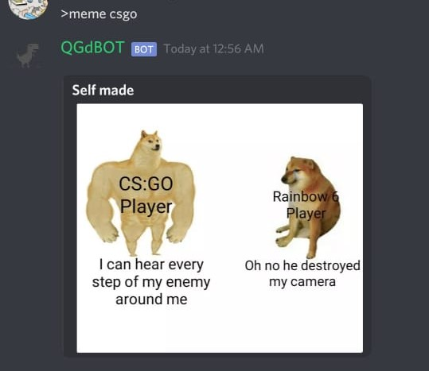
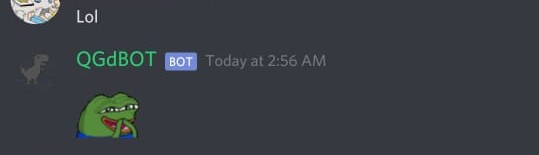
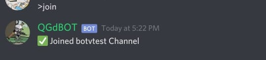
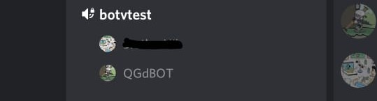
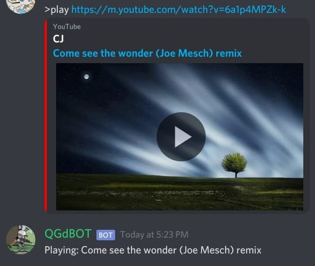
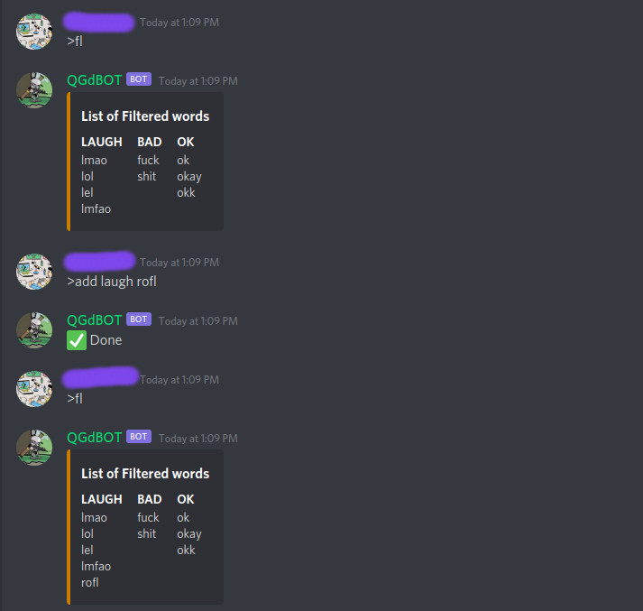

# Quaratined Gamers Discord Bot

## Command Prefix
Use '>' before text to interact with the bot.

Example:\
`>Yo`\
`>Hi`\
`>Bye`

## Memes
The Bot can display memes on different topics using simple command.\
`>meme (Topic name)`

Screenshot:\

## Animated Emojis
The Bot replies with animated emojis when the user message contains some specific words.

Example:\
`Lol`
`sed`

Screenshot:\

## Audio Playback
The Bot plays the audio of any Youtube video url provided to it.

In order to make the bot play an audio, the bot needs to join a voice channel involving the user who invokes it using `>join` command.

To play an audio, `>play` command must be typed in the discord server followed by the `url` of the Youtube video whose audio you want to listen.\
Example:
`>play http://www.youtube.com/watch?v={video.id}` 

Other Commands in this category:\
`>leave`\
`>pause`\
`>resume`\
`>stop`

*PS: Currently not supported in phones (on speakers).*

Screenshots:\

## Filter Words

The bot has various reactions for some words. each word falls into a category for which
the bot has same reaction/output. These words can now be
managed by the users using few commands.

This is done using Mongodb Database System. Storing all the the different words in
a collection. 

Commands:
1. To add word to a category: `>add [category] [word]`
2. To remove word from a category: `>rem [category] [word]`
3. To view the list of Filtered words: `>filist`

*PS: Only one word can be added or removed at a time. Currently there are predefined categories and each category has a 
certain word limit.*

Categories: `LAUGH` `BAD` `OK`

Screenshots:\

